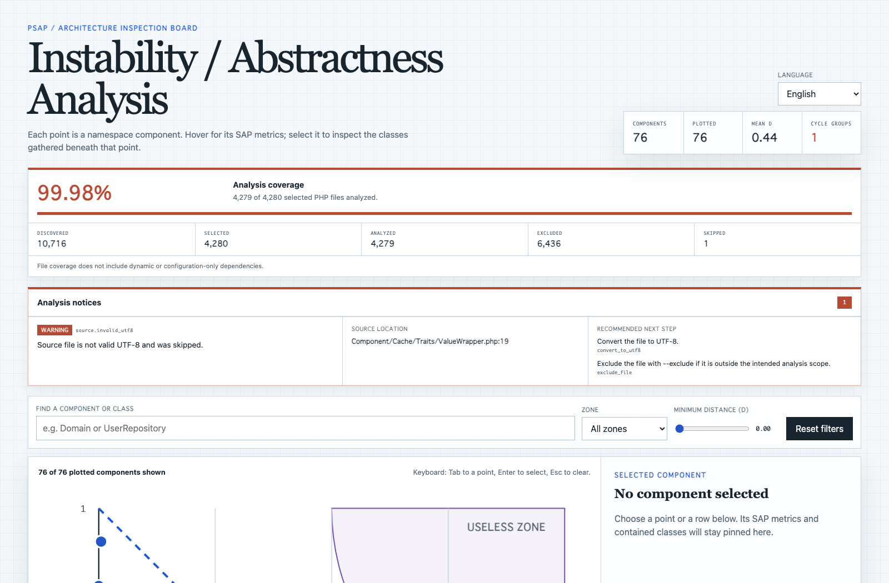
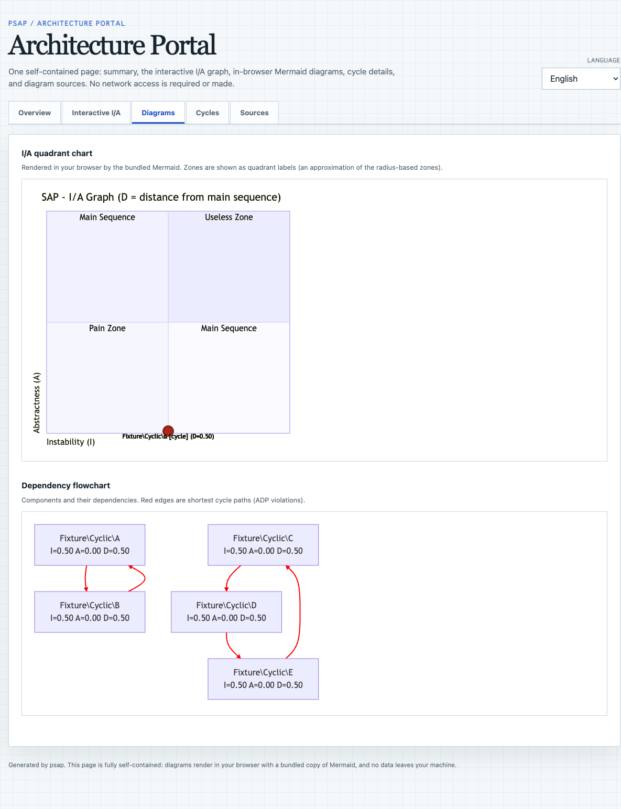

# psap

[](https://github.com/shimabox/psap/actions/workflows/ci.yml)
[](LICENSE)

psap (PHP SAP) is a CLI that statically analyzes PHP codebases and measures Clean Architecture's Stable Abstractions Principle metrics (Ca / Ce / I / A / D). It detects circular dependencies with file:line evidence and renders self-contained HTML / Mermaid / PlantUML reports. Analysis runs entirely locally — no code leaves your machine. Documentation is in Japanese.

`psap`（PHP SAP）は、PHP コードベースを解析して *Clean Architecture*（Robert C. Martin 著）第14章「安定度・抽象度等価の原則（SAP: Stable Abstractions Principle）」のメトリクス（Ca / Ce / I / A / D）を計測する CLI ツールです。

設計が変更しづらくなっている場所、依存が集中している場所、循環依存の原因を見つけるために使います。解析はローカルで完結し、外部サービスへソースコードを送りません。

psap自身を解析した[ポータルのデモ](https://shimabox.github.io/psap/)を公開しています。

## 分かること

- 名前空間ごとの安定度と抽象度
- 依存が集中しているコンポーネント
- 循環依存を構成する具体的な経路
- 依存が発生した構文、ファイル、行番号
- 以前の解析から新しく増えた循環依存

## おすすめの使い方

最も有効なのは、既存プロジェクトのMarkdownレポートを作り、コードへアクセスできる生成AIと一緒に設計上の問題を確認する使い方です。

### 1 インストール

Dockerイメージをビルドします。

```bash
git clone https://github.com/shimabox/psap.git
docker build -t psap --target dist -f psap/docker/Dockerfile psap
```

PHP 8.3以降があれば、[最新リリース](https://github.com/shimabox/psap/releases/latest)のpsap.pharでも使えます（[使い方](docs/getting-started.md#phar)）。

インストールできたことを確認します。

```bash
docker run --rm psap --version
```

### 2 レポートを作る

解析したいPHPプロジェクトへ移動し、ソースディレクトリを指定します。

```bash
cd /path/to/your-project
docker run --rm -v "$PWD":/workdir psap \
  analyze src/ --format markdown --output psap-report.md
```

この例では、現在のプロジェクトをコンテナ内の`/workdir`へ割り当て、ホスト側の`src/`を解析して、プロジェクト直下へ`psap-report.md`を出力します。任意の`/path/to/dir`を解析する方法や、結果を別のディレクトリへ出力する方法は[Dockerで解析対象と出力先を指定する](docs/getting-started.md#dockerで解析対象と出力先を指定する)を参照してください。

`--depth`はファイル探索の深さではなく、名前空間をコンポーネントに束ねる階層です。既定の`auto`は共通名前空間の直下を選ぶため、まずは指定せずに解析してください。  
より深い名前空間に独立した責務があり、内部の依存関係まで確認したい場合は、`--depth`を1段ずつ増やして結果を比較します。深くしすぎると内部実装まで別コンポーネントになり、レポートの複雑さと計算量も増えるため、最大値を選べばよいわけではありません。

### 3 結果を確認する

レポートが作成されたことを確認します。

```bash
sed -n '1,120p' psap-report.md
```

最初に`Review Priorities`を読み、次に`Circular Dependencies`と`Dependency Hotspots`を確認します。循環依存には、原因となるクラス、構文、ファイル、行番号が表示されます。

`Analysis coverage`には、発見、選択、解析、除外、スキップしたPHPファイル数が表示されます。スキップや解析上の注意がある場合は診断欄で、理由、ソース位置、推奨する次の対応を確認できます。  
カバレッジ100%は選択したPHPファイルをすべて処理できたことを示しますが、動的参照や設定ファイルだけに書かれた依存まで検出したことを意味しません。

IとAの分布をブラウザで確認する場合は、自己完結HTMLも生成できます。

```bash
docker run --rm -v "$PWD":/workdir psap \
  analyze src/ --format html --output psap-report.html
```

グラフの点へマウスを重ねると指標を確認でき、選択するとその名前空間コンポーネントに含まれるクラスを一覧できます。検索、ゾーン、最小Dによる絞り込みにも対応しています。



コンポーネント数が多いプロジェクトでは、まずHTMLで全体を俯瞰し、検索や指標で確認対象を絞る使い方が適しています。MermaidとPlantUMLは、解析対象や`--depth`を調整したうえで、関心のある範囲を静的な図として確認・共有する場合に向いています。

デフォルトの表示は英語です。HTML右上の言語セレクターから日本語へ切り替えられます。

HTMLは実際のゾーン判定を円弧で表示します。Mermaidの`quadrantChart`は同じゾーンを象限として近似表示するため、形は異なりますが点の指標と座標は共通です。

サマリー、I/Aグラフ、図、循環詳細、図ソースを1ファイルにまとめたポータル（`--format portal`）も生成できます。

```bash
docker run --rm -v "$PWD":/workdir psap \
  analyze src/ --format portal --output psap-portal.html
```

`psap-portal.html`をブラウザで開くと、Overview・Interactive I/A・Diagrams・Cycles・Sourcesのタブを切り替えられます。  
Diagramsタブの`quadrantChart`と依存フローチャートは同梱したMermaidがブラウザ内で描画し、拡大・移動もできます。  
SourcesタブからはMermaid（`.mmd`）・PlantUML（`.puml`）の図ソースとMarkdownレポート（`psap-report.md`）をコピー・ダウンロードできます。  
解析結果もMermaidも1ファイルに収まるため外部通信は発生せず、出力サイズは+3.5MB前後になります。



依存フローチャートのエッジ数が500を超えると、ブラウザ内描画を省略してソース表示に切り替えます。

### 4 生成AIへ渡す

Claude Code, Codexなど、解析対象のコードを読める生成AIに次のように依頼してみましょう。

```text
psap-report.mdを読んで、優先して直すべき問題を3件挙げてください。
レポートに記載されたソースコードも確認し、意図的な依存か問題のある依存かを判断してください。
それぞれについて、判断の根拠、影響、具体的な修正方針を示してください。
まだコードは変更しないでください。
```

### 5 コードで確かめる

生成AIの提案と、レポートに記載されたファイル・行番号を照らし合わせます。循環依存が実際に不要か、名前空間の分け方が適切か、変更後の責務が明確になるかを確認してから修正します。

修正後に同じコマンドを再実行し、循環や依存が減ったことを確認します。継続して監視したい場合は、同じ解析条件をCIへ追加します。

<details>
<summary>レポートで得られる内容</summary>

名前空間ごとのクラス数、Ca、Ce、I、A、D、問題領域を一覧できます。

```text
Component         Classes  Ca  Ce     I     A     D  Zone
----------------  -------  --  --  ----  ----  ----  ----------
App\Domain              8   3   1  0.25  0.25  0.50
App\Infrastructure      4   0   3  1.00  0.00  0.00
```

循環依存がある場合は、原因となるクラスとコード位置まで表示します。

```text
App\Domain\Order -> App\Infrastructure\OrderRepository
  parameter_type at Domain/Order.php:18
```

Markdownレポートには、優先して確認する箇所、循環依存、依存の多い箇所、全コンポーネントの指標がまとまります。

</details>

<details>
<summary>コンポーネントが1件だけになる場合</summary>

警告に従って`--depth`を増やします。

```bash
docker run --rm -v "$PWD":/workdir psap \
  analyze src/ --depth 3 --format markdown --output psap-report.md
```

深さを増やしても1件の場合は、名前空間が分割されていないか、解析対象の指定が狭すぎる可能性があります。

depthを変えるとコンポーネント境界が変わり、Ca、Ce、I、D、循環依存も再計算されます。異なるdepthの数値は同じ条件の推移として比較せず、採用する粒度を決めてからCIや循環ベースラインに固定してください。

</details>

<details>
<summary>複数のソースディレクトリを解析する場合</summary>

解析対象のパスを続けて指定します。

```bash
docker run --rm -v "$PWD":/workdir psap \
  analyze src/ packages/ --format markdown --output psap-report.md
```

</details>

## CIで使う

Dが閾値を超えた場合や、循環依存が見つかった場合に終了コード`1`を返せます。

```bash
docker run --rm -v "$PWD":/workdir psap \
  analyze src/ --threshold 0.6 --fail-on-cycle
```

既存の循環をベースラインとして保存し、新しく増えた循環だけを検出することもできます。

## ドキュメント

- [導入と基本操作](docs/getting-started.md)
- [解析内容と出力形式](docs/analysis.md)
- [CIでの利用](docs/ci.md)
- [開発](docs/development.md)

PHP 8.3以降が必要です。Dockerを使う場合、ホスト側のPHPは不要です。

## ライセンス

[MIT License](LICENSE)
