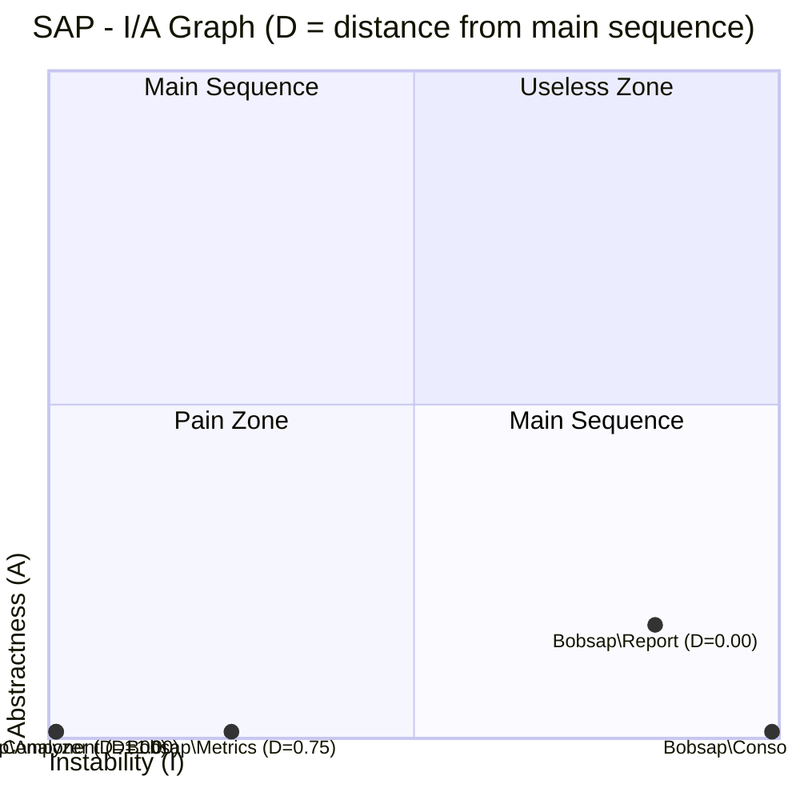

# bobsap

`bobsap` は、PHP コードベースを解析して *Clean Architecture*（Robert C. Martin 著）第14章「安定度・抽象度等価の原則（SAP: Stable Abstractions Principle）」のメトリクス（Ca / Ce / I / A / D）を計測する CLI ツールです。名前空間ごとの安定度・抽象度をテキスト表や図（Mermaid / PlantUML）で可視化し、CI のゲートとしても使えます。

## 名前の由来

**Bob** おじさん（Robert C. Martin の愛称）+ **SAP**（Stable Abstractions Principle）＝ `bobsap`。

## メトリクス

| 指標 | 定義 | 意味 |
|---|---|---|
| Ca（ファン・イン） | コンポーネント外から、コンポーネント内のクラスに依存しているクラス数 | 求心性結合。大きいほど安定 |
| Ce（ファン・アウト） | コンポーネント内から、コンポーネント外のクラスに依存しているクラス数 | 遠心性結合。大きいほど不安定 |
| I（不安定さ） | `Ce / (Ca + Ce)` | 0 = 最安定、1 = 最不安定 |
| A（抽象度） | `抽象型数 / 総型数` | 0 = 具象のみ、1 = 抽象のみ |
| D（主系列からの距離） | `\|A + I - 1\|` | 0 = 主系列上（理想）、1 = 最も遠い |

- **抽象型**: `interface`、`abstract class`
- **具象型**: `class`、`enum`、`trait`（v1 では trait も具象として扱う）
- **主系列**: A + I = 1 の直線。安定度と抽象度がバランスした理想状態
- **苦痛ゾーン**: `(I, A) = (0, 0)` 付近。安定していて具象的 → 変更しづらく差し替えも効かない
- **無駄ゾーン**: `(I, A) = (1, 1)` 付近。不安定なのに抽象的 → 誰にも使われない抽象化
- コンポーネント全体の D の平均・分散も出力します（設計を統計的に俯瞰するため）

コンポーネントの単位は **名前空間** です。`--depth N` で束ねる深さを指定します（例: `depth=2` なら `App\Domain\Model\User` は `App\Domain` というコンポーネントに属する）。

## インストール / 使い方

### Docker（推奨）

配布用イメージをビルドして、解析したいプロジェクトをカレントディレクトリとしてマウントします。

```bash
# イメージをビルド（--target dist を明示。省略すると PlantUML 同梱の大きいイメージになる）
docker build -t bobsap --target dist -f docker/Dockerfile .

# 解析対象プロジェクトのルートで実行（$PWD が /workdir にマウントされる）
docker run --rm -v "$PWD":/workdir bobsap analyze src/
```

他プロジェクトを計測する場合は、そのプロジェクトのディレクトリで同じコマンドを実行するだけです。

```bash
cd /path/to/other-project
docker run --rm -v "$PWD":/workdir bobsap analyze src/ --depth 2
```

### PlantUML 同梱イメージ（analyze して即 PNG）

`--format plantuml` の出力をそのまま画像化したいだけなら、PlantUML レンダラー（Java + plantuml.jar + graphviz + CJK フォント）を同梱した `dist-plantuml` イメージが便利です。`analyze-png` というショートカットコマンドで、計測から PNG 出力までを1コマンドで行えます。

```bash
# イメージをビルド（make build-plantuml でも同じ）
docker build -t bobsap:plantuml --target dist-plantuml -f docker/Dockerfile .

# 解析対象プロジェクトのルートで実行すると、カレントディレクトリに bobsap-report.png ができる
docker run --rm -v "$PWD":/workdir bobsap:plantuml analyze-png src/ --depth 2
```

`analyze-png` 以外の引数を渡した場合は通常の `dist` イメージと同じく `bobsap` コマンドとして動作します（`docker run --rm -v "$PWD":/workdir bobsap:plantuml analyze src/` のように使えます）。

このイメージは Java・graphviz・CJK フォントを含むため、`dist` イメージ（約 545MB）より大きくなります（手元のビルドで約 940MB）。PNG 化が不要な用途では通常の `dist` イメージを使ってください。

### phar（単一ファイル配布）

Docker が使えない環境向けに、`clue/phar-composer` で単一ファイルの `bobsap.phar` を生成できます（開発者向け。生成コマンドは後述の「開発者向け」セクション参照）。

```bash
make phar
php bobsap.phar analyze src/
```

### Composer 経由

現時点では Packagist に未公開です。将来的に `composer require --dev shimabox/bobsap` で導入できるようにする予定ですが、それまでは git リポジトリを直接指定してください。

```bash
composer config repositories.bobsap vcs https://github.com/shimabox/bobsap
composer require --dev shimabox/bobsap:dev-main
vendor/bin/bobsap analyze src/
```

## CLI オプション

```
bobsap analyze <paths>... [options]
```

| オプション | 説明 | デフォルト |
|---|---|---|
| `--depth` | コンポーネントに束ねる名前空間の深さ | `2` |
| `--format` | 出力形式（`text` \| `json` \| `mermaid` \| `plantuml`） | `text` |
| `--output` | 出力先ファイル（省略時は標準出力） | 標準出力 |
| `--exclude` | 除外パターン（fnmatch 形式、複数指定可） | なし |
| `--threshold` | D 値がこの値を超えるコンポーネントがあれば exit code 1 にする | なし（チェックしない） |
| `--fail-on-cycle` | 循環依存（ADP違反）が1つでもあれば exit code 1 にする | なし（チェックしない） |
| `--no-docblock` | docblock（`@var` / `@param` / `@return`）からの依存抽出を無効にする | なし（docblock も解析する） |

### exit code

| コード | 意味 |
|---|---|
| `0` | 正常終了（`--threshold` / `--fail-on-cycle` 指定時はゲート違反なし） |
| `1` | `--threshold` を超えるコンポーネントがあった、または `--fail-on-cycle` 指定時に循環依存が見つかった |
| `2` | 入力エラー（存在しないパス、未知の `--format` など） |

## 出力例

以下は `bobsap` 自身（`src/`）を解析した実際の出力です（詳細は後述の「bobsap を bobsap で計測する」を参照）。

### text

```
bobsap - Stable Abstractions Principle metrics

Component         Classes  Ca  Ce     I     A     D  Zone
----------------  -------  --  --  ----  ----  ----  ----------
Bobsap\Analyzer         7   4   0  0.00  0.00  1.00  ⚠ 苦痛ゾーン
Bobsap\Component        4   4   0  0.00  0.00  1.00  ⚠ 苦痛ゾーン
Bobsap\Console          1   0   1  1.00  0.00  0.00
Bobsap\Metrics          4   6   2  0.25  0.00  0.75  ⚠ 苦痛ゾーン
Bobsap\Report           6   1   5  0.83  0.17  0.00

Statistics: mean(D)=0.55, variance(D)=0.21
```

### mermaid

GitHub 上では下のコードブロックがそのまま図としてレンダリングされます。



### plantuml

[PlantUML online server](https://www.plantuml.com/plantuml) 等に貼ると依存グラフとして描画されます。

```
@startuml
' bobsap - SAP metrics
skinparam rectangle {
  BackgroundColor White
  BorderColor Black
}
rectangle "Bobsap\\Analyzer\nI=0.00 A=0.00 D=1.00" as C1 #FFCCCC
rectangle "Bobsap\\Component\nI=0.00 A=0.00 D=1.00" as C2 #FFCCCC
rectangle "Bobsap\\Console\nI=1.00 A=0.00 D=0.00" as C3
rectangle "Bobsap\\Metrics\nI=0.25 A=0.00 D=0.75" as C4 #FFCCCC
rectangle "Bobsap\\Report\nI=0.83 A=0.17 D=0.00" as C5
C3 --> C1
C3 --> C2
C3 --> C4
C3 --> C5
C4 --> C1
C4 --> C2
C5 --> C1
C5 --> C2
C5 --> C4

legend right
  Pain Zone = #FFCCCC
  Useless Zone = #FFF2CC
  Normal = no color
  Red edge = dependency cycle (ADP violation)
endlegend
@enduml
```

## 循環依存検出（ADP）

`bobsap` は SAP のメトリクスに加えて、第14章の**非循環依存関係の原則（ADP: Acyclic Dependencies Principle）**の違反もチェックします。コンポーネント間の依存グラフに循環（A が B に依存し、B も何らかの経路で A に依存し返す状態）があると、片方の変更が芋づる式にもう一方へ波及し、ビルド順序やデプロイ単位も分割できなくなります。相互依存（2ノード）だけでなく、3コンポーネント以上をまたぐ間接的な循環も強連結成分（SCC）検出によってまとめて見つけます。

### text 出力

循環が見つかったコンポーネントがあるときだけ、統計行の後に `Cycles (ADP violation):` セクションが出ます（循環がなければ何も出ません）。2ノードの相互依存は `<->`、3ノード以上は先頭コンポーネントに戻る `->` チェーンで表記します。

```
bobsap - Stable Abstractions Principle metrics

Component         Classes  Ca  Ce     I     A     D  Zone
----------------  -------  --  --  ----  ----  ----  ----------
Fixture\Cyclic\A        1   1   1  0.50  0.00  0.50
Fixture\Cyclic\B        1   1   1  0.50  0.00  0.50
Fixture\Cyclic\C        1   1   1  0.50  0.00  0.50
Fixture\Cyclic\D        1   1   1  0.50  0.00  0.50
Fixture\Cyclic\E        1   1   1  0.50  0.00  0.50

Statistics: mean(D)=0.50, variance(D)=0.00

Cycles (ADP violation):
  - Fixture\Cyclic\A <-> Fixture\Cyclic\B
  - Fixture\Cyclic\C -> Fixture\Cyclic\D -> Fixture\Cyclic\E -> Fixture\Cyclic\C
```

### json 出力

`cycles` フィールドに循環ごとのコンポーネント名リストが入ります（循環がなければ空配列 `[]`）。

```json
"cycles": [
    ["Fixture\\Cyclic\\A", "Fixture\\Cyclic\\B"],
    ["Fixture\\Cyclic\\C", "Fixture\\Cyclic\\D", "Fixture\\Cyclic\\E"]
]
```

### plantuml 出力

循環（SCC）に含まれる依存エッジは赤い太線 `-[#red,thickness=2]->` で強調されます（前掲の「plantuml」の凡例に `Red edge = dependency cycle (ADP violation)` が常に併記されます）。

### `--fail-on-cycle` で CI ゲートにする

`--threshold` と同じ流儀で、循環が1つでもあれば stderr に一覧を出して exit code 1 にします。

```bash
docker compose run --rm app php bin/bobsap analyze tests/Fixtures/CyclicProject --depth 3 --fail-on-cycle
# 循環依存（ADP違反）が見つかりました:
#   - Fixture\Cyclic\A <-> Fixture\Cyclic\B
#   - Fixture\Cyclic\C -> Fixture\Cyclic\D -> Fixture\Cyclic\E -> Fixture\Cyclic\C
# exit code: 1
```

### Mermaid の制限

`--format mermaid` の `quadrantChart` はコンポーネントを点として I/A 平面に配置するだけで、コンポーネント間の依存エッジ（矢印）を表現できません。そのため循環の可視化は非対応です。循環を図で確認したい場合は `--format plantuml` を使ってください。

## bobsap を bobsap で計測する

自分自身の `src/` を計測するとどうなるか、実行結果をそのまま載せます。

```bash
docker compose run --rm app php bin/bobsap analyze src/ --depth 2
```

```
bobsap - Stable Abstractions Principle metrics

Component         Classes  Ca  Ce     I     A     D  Zone
----------------  -------  --  --  ----  ----  ----  ----------
Bobsap\Analyzer         7   4   0  0.00  0.00  1.00  ⚠ 苦痛ゾーン
Bobsap\Component        4   4   0  0.00  0.00  1.00  ⚠ 苦痛ゾーン
Bobsap\Console          1   0   1  1.00  0.00  0.00
Bobsap\Metrics          4   6   2  0.25  0.00  0.75  ⚠ 苦痛ゾーン
Bobsap\Report           6   1   5  0.83  0.17  0.00

Statistics: mean(D)=0.55, variance(D)=0.21

Classes in Bobsap\Analyzer:
  - Bobsap\Analyzer\AnalysisResult (concrete)
  - Bobsap\Analyzer\ClassInfo (concrete)
  - Bobsap\Analyzer\DependencyAnalyzer (concrete)
  - Bobsap\Analyzer\Internal\DependencyNameCollector (concrete)
  - Bobsap\Analyzer\Internal\RootClassLikeCollector (concrete)
  - Bobsap\Analyzer\SourceFinder (concrete)
  - Bobsap\Analyzer\TypeKind (enum)

Classes in Bobsap\Component:
  - Bobsap\Component\Component (concrete)
  - Bobsap\Component\ComponentClassifier (concrete)
  - Bobsap\Component\CycleDetector (concrete)
  - Bobsap\Component\DependencyGraph (concrete)

Classes in Bobsap\Metrics:
  - Bobsap\Metrics\ComponentMetrics (concrete)
  - Bobsap\Metrics\MetricsCalculator (concrete)
  - Bobsap\Metrics\MetricsSummary (concrete)
  - Bobsap\Metrics\Zone (enum)
```

同じ入力を `--format mermaid` で描画すると次の図になります（前掲の「出力例」と同一データ）。


**考察**: `Bobsap\Console`（`AnalyzeCommand` だけの 1 クラス）は I=1.00・A=0.00 で主系列上（D=0.00）にあります。CLI の合成ルートとして他の全コンポーネントに依存しつつ誰からも依存されない、という位置づけとして妥当です。一方で `Analyzer` / `Component` / `Metrics` はいずれも抽象型を持たず（A=0.00）Ce=0 で外部依存がないため I=0.00 となり、「苦痛ゾーン」判定になっています。ただしこれらはパイプラインの中核となる値オブジェクト・計算ロジック群で、外部から差し替える必要がないという設計意図の裏返しでもあります。SAP のゾーン判定は機械的な警告であり、最終的な良し悪しはコンポーネントの役割と合わせて人間が判断する必要がある、という点が実際の計測からも確認できました。

## CI での利用例（GitHub Actions）

```yaml
name: bobsap
on: [pull_request]
jobs:
  sap-metrics:
    runs-on: ubuntu-latest
    steps:
      - uses: actions/checkout@v4
      - name: build bobsap image
        run: docker build -t bobsap --target dist -f docker/Dockerfile .
      - name: run analyze with threshold gate
        run: docker run --rm -v "$PWD":/workdir bobsap analyze src/ --threshold 0.6
```

`--threshold` を超えるコンポーネントがあれば exit code 1 になり、ジョブが失敗します。

## v1 の制限事項

以下は v1 のスコープ外です。実装は行いません。

- **docblock 内の型も解析対象**（プロパティの `@var X`、メソッド・コンストラクタの `@param X $p` / `@return X`。プロモートされたコンストラクタ引数の `@param` も対象。`X[]` / `array<X>` / `array<int, X>` / `?X` / `X|Y` / `X&Y` の分解、短縮名の use文・名前空間による FQCN 解決に対応。プリミティブ・疑似型（`int`、`mixed`、`self` 等）は除外。壊れた docblock は無視してスキップする。`--no-docblock` でこの解析を無効化できる）
- **文字列ベースの参照は数えない**（`class_exists('X')`、`new $className` のような動的な参照）
- **trait は具象型として数える**（trait 自体に抽象・具象の概念がないための割り切り）
- **無名クラスは非対応**（宣言・依存関係のどちらにも数えない）
- **解析対象パス外のクラスへの依存は Ce に数えない**（PHP 組み込みクラスや外部ライブラリへの依存はコンポーネント間メトリクスのノイズになるため対象外）
- **設定ファイル非対応**（`.bobsap.json` 等はなく、CLI オプションのみ）
- **コンポーネント分類は名前空間ベースのみ**（ディレクトリベースの分類はしない）
- **D 値の推移記録・HTML レポートは非対応**（`--format json` の出力を自前で時系列に貯めることは可能）
- **Mermaid（quadrantChart）は循環依存を表示できない**（依存エッジを描けない図種のため。循環を図で見たい場合は `--format plantuml` を使う）

## 開発者向け

### セットアップ・コマンド

開発コマンドはすべて Docker 経由です。ホストマシンに PHP / Composer は不要です。

```bash
make setup          # イメージをビルドして composer install
make test           # phpunit
make stan           # phpstan（level: max）
make cs             # コーディングスタイルチェック（dry-run）
make cs-fix         # コーディングスタイルを自動整形
make phar           # bobsap.phar を生成する（clue/phar-composer。docker/Dockerfile の phar ステージを利用）
make build-dist     # 配布用の実行イメージをビルドする（bobsap:dist）
make build-plantuml # PlantUML 同梱の配布用イメージをビルドする（bobsap:plantuml）
```

Makefile を経由せず直接叩く場合は `docker compose run --rm app composer test` のように実行します。

### 配布物のスリム化（.gitattributes）

`.gitattributes` で `tests/` / `.github/` / `docker/` / `compose.yaml` / `Makefile` / 各種設定ファイル（`phpunit.xml.dist` 等）を `export-ignore` にしています。`git archive`（Packagist・GitHub のリリース tarball 生成で使われる）で配布物を作ると、これらの開発専用ファイルが含まれず配布物がスリム化されます。ローカルの `git archive` では確認できますが、`export-ignore` は対象ファイルがコミット済みであって初めて有効になる点に注意してください。

```bash
git archive HEAD | tar -t | head -30
```

### CI（GitHub Actions）

`push`（main）と Pull Request で `.github/workflows/ci.yml` が走ります。`checks` ジョブは PHP 8.5 で `composer validate --strict` / `composer test` / `composer stan` / `composer cs` を実行し、成功後に `self-metrics` ジョブが bobsap 自身の `src/` を計測（ドッグフーディング）します。text / mermaid / plantuml / json の4形式を Artifact にアップロードし、`--fail-on-cycle` で循環依存がないこともゲートします。
自己計測の結果（テキスト表と I/A の mermaid 図）は Actions の実行結果画面の Step Summary にそのまま表示されるので、ジョブを開くだけで確認できます。

### アーキテクチャ概要

データフロー: `SourceFinder → DependencyAnalyzer → ClassInfo[] → ComponentClassifier → Component[] → MetricsCalculator → ComponentMetrics[] → Reporter`

`Component[]` は並行して `DependencyGraph → CycleDetector` にも渡され、循環依存（ADP違反）の検出結果が `ReportData` 経由で各 Reporter に渡ります。

各段が純粋な変換になるように分割されています。

```
src/
├── Analyzer/   # ファイル走査（SourceFinder）・AST 解析（DependencyAnalyzer）・型/依存情報（ClassInfo）
├── Component/  # 名前空間 → コンポーネントへの分類、依存グラフ（DependencyGraph）・循環検出（CycleDetector）
├── Metrics/    # Ca/Ce/I/A/D の計算、ゾーン判定、統計
├── Report/     # text / json / mermaid / plantuml の各レンダラー
└── Console/    # symfony/console による CLI コマンド（analyze）
```

## ライセンス

MIT License. 詳細は [LICENSE](LICENSE) を参照してください。
